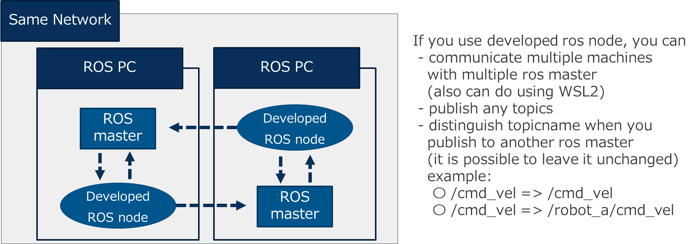

# rosbridge_bridge
This system can help connect mutliple roscores using rosbridge. Note that in most cases it is recommended to [use one roscore](http://wiki.ros.org/ROS/Tutorials/MultipleMachines) or a more advanced 
multimaster system.

The details of this ros node is in [here (Japanese)](https://qiita.com/koichi_baseball/private/8d15a06d296c09908f5f) (Qiita ROS Advent Calendar 2021).  

Features
 - forward topics between multiple ros masters
 - works with WSL2
 - use include / exclude rules to specify topic names
 - optionally add topic prefixes
    * /cmd_vel => /cmd_vel
    * /cmd_vel => /robot_a/cmd_vel



# Dependencies
[ROS bridge](http://wiki.ros.org/rosbridge_suite), [rospy-message-converter](http://wiki.ros.org/rospy_message_converter), [roslibpy](https://roslibpy.readthedocs.io/en/latest/)

```shell
sudo apt-get install ros-<rosdistro>-rosbridge-server ros-<rosdistro>-rospy-message-converter
pip3 install roslibpy
```

# launch
This program only forwards in one direction. If you want to forward topics in both directions there must be an instance of this node on both sides. 
It is important that the configurations are different because otherwise messages will be forwarded endlessly between the two nodes.


There are two modes: `rosbridge_to_rosbridge` forwards between two rosbridge servers and `rosbridge_to_ros` forwards from a rosbridge server to the local roscore.

### ROS bridge websocket server
```shell
roslaunch rosbridge_server rosbridge_websocket.launch
```

### ROS to ROS Bridge (this node)
```shell
roslaunch rosbridge_bridge rosbridge_to_rosbridge.launch
```

OR

```shell
roslaunch rosbridge_bridge rosbridge_to_ros.launch
```


| param name    | default          | description                                                     |
| :-:           | :-:              | :-:                                                             |
| host_from     | 127.0.0.1        | Address of Websocket server to subscribe on                     |
| port_from     | 9090             | Port of Websocket server to subscribe on                        |
| host_to       | 127.0.0.1        | Address of Websocket server to publish on                       |
| port_to       | 9090             | Port of Websocket server to publish on                          |
| use_id_for_ns | false            | Use id as topic name prefix? (If true, /cmd_vel => /id/cmd_vel) |
| config_file   | conf/config.yaml | Location of forwarding rule configuration file                  |

## Config
Use `rosbridge_bridge/conf/config.yaml` to set rules for including or excluding topics to forward. Adding any "include" rules will cause the "exclude" rules to be ignored.

| Item           | Explanation                                        |
| :-:            | :-:                                                |
| id             | id for topicname when bridge                       |
| exclude_topics | Topics for which bridges are excluded              |
| include_topics | The topic to be bridged (topic name and data type) |
